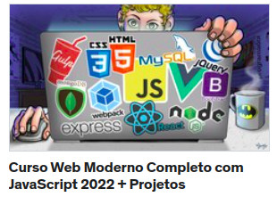

# Curso Web Moderno

## O que eu estudei no curso

- Lógica de programação
- JavaScript
- Node.js
- ESNext
- HTML5
- CSS3
- Integração HTML5, CSS3 e Javascript
- Ajax
- Gulp
- Webpack
- jQuery
- Bootstrap
- React
- Next
- VueJS
- Angular 9
- Banco de dados Relacional
- Banco de dados Não relacional
- Express

```
Curso Web Moderno Completo com JavaScript 2022 + Projetos

```
<a href= "https://www.cod3r.com.br/">COD3R CURSOS</a>

## Como divide os módulos do curso
 Cada branch representa um módulo, e a sequência de branchs segue a lógica do curso. <br>
 Também esta cheio de comentários para que sirva como material de consulta 
 <hr>
 <br>

 <p align ="center"> </p>
<br><hr>


